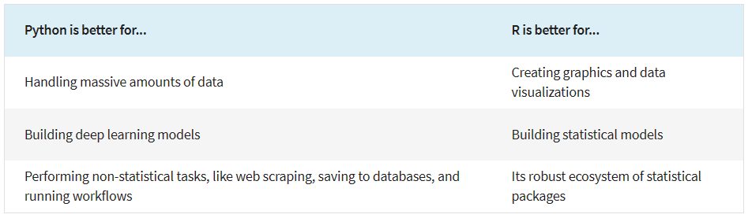

## 1. What is Python

[Python](https://www.python.org/) is a high-level, interpreted programming language known for its simplicity, readability, and versatility. It was created by Guido van Rossum and first released in 1991. Python is designed to emphasize **code readability**, making it easy for programmers to express their ideas in a clear and concise manner.

It is widely used in various fields, such as web development, data science, machine learning, scientific computing, automation, scripting, and more. It has gained immense popularity over the years due to its ease of learning, broad applicability, and strong community support.

## 2. Why Python for Data Analysis

Python has emerged as one of the most popular programming languages for data analysis due to its simplicity, versatility, and a rich ecosystem of libraries specifically designed for this purpose. Here's an overview of why Python is well-suited for data analysis:

1). **Readability and Expressiveness**: Python's clean and readable syntax makes it easy for analysts and data scientists to write and understand code. The language's expressiveness allows for concise and efficient data manipulation and analysis tasks.

2). **Robust Data Libraries**: Python offers powerful libraries for data analysis, including NumPy, Pandas, and Matplotlib. [NumPy](https://numpy.org/doc/stable/) provides support for numerical operations and arrays, while [Pandas](https://pandas.pydata.org/docs/) offers data structures (e.g., DataFrames) and tools for data manipulation and analysis. [Matplotlib](https://matplotlib.org/stable/gallery/index.html) facilitates data visualization.

3). **Extensive Ecosystem**: Python's data analysis ecosystem is vast and continuously growing. Beyond the core libraries, there are numerous additional packages such as [SciPy](https://docs.scipy.org/doc/scipy/) (for scientific computing), [Seaborn](https://seaborn.pydata.org/examples/index.html) (for statistical data visualization), and [Scikit-learn](https://scikit-learn.org/stable/auto_examples/index.html) (for machine learning).

4). **Jupyter Notebooks**: [Jupyter Notebooks](https://jupyter.org/) are interactive, web-based environments that allow data analysts to combine code, visualizations, and narrative text. This feature makes it easy to create and share data analysis reports in a reproducible manner.

5). **Cross-platform Compatibility**: Python is a cross-platform language, meaning it can run on different operating systems. This makes it convenient for data analysts to work on various platforms without any compatibility issues.

6). **Active Community and Support**: Python has a vibrant and supportive community of data analysts, scientists, and developers. The community actively contributes to open-source projects, shares knowledge, and provides assistance through forums and resources.

7). **Integration with Other Technologies**: Python easily integrates with various tools and technologies, making it suitable for end-to-end data analysis workflows. It can be seamlessly combined with databases, cloud services, big data frameworks, and web technologies.

## 3. Python and/or R

*Source: Coursera, [Python or R for Data Analysis: Which Should I Learn?](https://www.coursera.org/articles/python-or-r-for-data-analysis)*

 

This page is meant to help you to decide whether Python is the right tool for your analysis needs.  
What questions do you have about whether or not to try out Python for your data analysis tasks? Now is a good time to share your questions, thoughts and comments.
